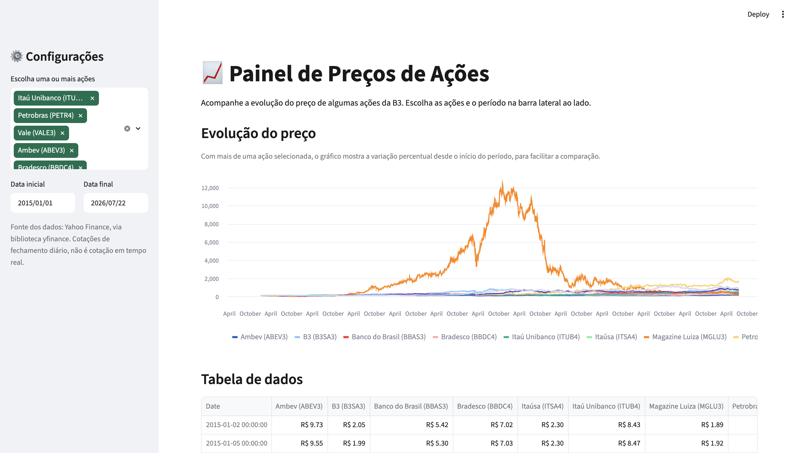

# 📈 Painel de Preços de Ações

Aplicação web feita em **Python + Streamlit** para acompanhar a evolução do
preço de ações da B3, com gráfico comparativo, métricas rápidas e exportação
dos dados em CSV.

Projeto de estudo, feito por **Bruno Nunes**, durante minha transição de
carreira para Dados / IA.

🔗 **App publicado:** _cole aqui o link depois do deploy, ex: `https://painel-precos-acoes.streamlit.app`_


> Dica: depois de rodar o app localmente, tire um print da tela e salve como
> `assets/preview.png` para essa imagem aparecer aqui.

---

## ✨ Funcionalidades

- Seleção de uma ou várias ações da B3 (ex.: Itaú, Petrobras, Vale, Ambev...)
- Escolha livre do período de análise (data inicial e final)
- Gráfico de evolução do preço:
  - 1 ação selecionada → preço em R$
  - várias ações selecionadas → variação percentual, para comparar ações de
    preços bem diferentes no mesmo gráfico
- Métricas rápidas (preço atual, variação no período, máxima e mínima)
- Tabela de dados formatada em R$
- Botão para baixar os dados em CSV
- Cache dos dados (evita baixar tudo de novo a cada clique)

---

## 🛠️ Tecnologias

- [Python 3](https://www.python.org/)
- [Streamlit](https://streamlit.io/) — interface web
- [pandas](https://pandas.pydata.org/) — manipulação dos dados
- [yfinance](https://pypi.org/project/yfinance/) — busca das cotações no
  Yahoo Finance

---

## ⚠️ Sobre a fonte dos dados

Este projeto usa a biblioteca **yfinance**, que busca dados públicos do
Yahoo Finance. Alguns pontos importantes para quem for usar ou avaliar este
projeto:

- **Não é uma API oficial do Yahoo.** É uma ferramenta open-source de uso
  livre, voltada para estudo e pesquisa — não para decisões de investimento
  em tempo real.
- **Os preços são de fechamento diário** (ou levemente atrasados durante o
  pregão), não é uma cotação de milissegundo tipo home broker.
- **Pode haver bloqueio temporário por excesso de requisições** (erro comum
  do tipo "rate limit"). O app já usa cache de 1 hora para reduzir isso, mas
  se acontecer, basta esperar alguns minutos e recarregar a página.

Para um projeto de portfólio e estudo, é exatamente o uso para o qual a
biblioteca foi feita.

---

## ▶️ Como rodar localmente

**Pré-requisitos:** ter o [Python 3.9+](https://www.python.org/downloads/)
instalado.

**1. Clone o repositório**
```bash
git clone https://github.com/bruno-dsn/painel-precos-acoes.git
cd painel-precos-acoes
```

**2. Crie um ambiente virtual (recomendado)**
```bash
python -m venv .venv

# Ativar no Windows
.venv\Scripts\activate

# Ativar no Mac/Linux
source .venv/bin/activate
```

**3. Instale as dependências**
```bash
pip install -r requirements.txt
```

**4. Rode o app**
```bash
streamlit run app.py
```

O Streamlit vai abrir automaticamente o navegador em `http://localhost:8501`.

---

## ☁️ Como publicar (deploy) no Streamlit Community Cloud

O jeito mais simples e gratuito de publicar um app Streamlit.

**1. Suba o projeto para o GitHub**
- Crie um repositório novo (pode ser público) e envie todos os arquivos deste
  projeto para ele.

**2. Acesse o Streamlit Community Cloud**
- Entre em [share.streamlit.io](https://share.streamlit.io) e faça login com
  sua conta do GitHub.

**3. Crie o app**
- Clique em **"New app"**.
- Escolha o repositório, a branch (geralmente `main`) e o arquivo principal
  (`app.py`).
- Clique em **"Deploy"**.

**4. Aguarde o build**
- O Streamlit Cloud instala as dependências do `requirements.txt`
  automaticamente. Isso leva 1–2 minutos na primeira vez.
- Ao final, você recebe uma URL pública (ex.: `seu-app.streamlit.app`) para
  compartilhar — inclusive no seu LinkedIn e currículo.

**5. Atualizações automáticas**
- Todo `git push` para o repositório atualiza o app publicado
  automaticamente, sem precisar refazer o deploy.

---

## 📂 Estrutura do projeto

```
painel-precos-acoes/
├── app.py                   # código principal da aplicação
├── requirements.txt         # dependências do projeto
├── .streamlit/
│   └── config.toml          # tema visual do app
├── assets/
│   └── preview.png          # print do app (adicionar depois de rodar)
├── .gitignore
├── LICENSE
└── README.md
```

---

## 🚀 Possíveis melhorias futuras

- Adicionar gráfico de candlestick (velas)
- Incluir médias móveis (curto e longo prazo)
- Comparar uma ação com o Ibovespa (IBOV)
- Permitir digitar qualquer ticker, além da lista pré-definida
- Guardar histórico de ações mais consultadas

---

## 👤 Autor

**Bruno Nunes**
Profissional de TI em transição de carreira para Dados e IA, atualmente no
programa Pós-Tech AI Scientist (FIAP + Alura).

- GitHub: [github.com/bruno-dsn](https://github.com/bruno-dsn)
- LinkedIn: [linkedin.com/in/bruno-dsnunes](https://www.linkedin.com/in/bruno-dsnunes/)

---

## 📄 Licença

Este projeto está sob a licença MIT — veja o arquivo [LICENSE](LICENSE) para
mais detalhes.
